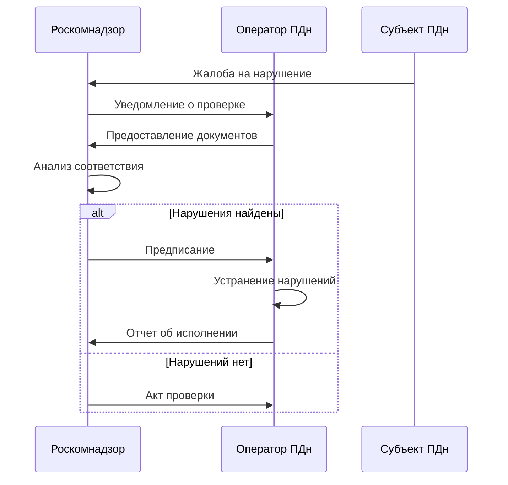
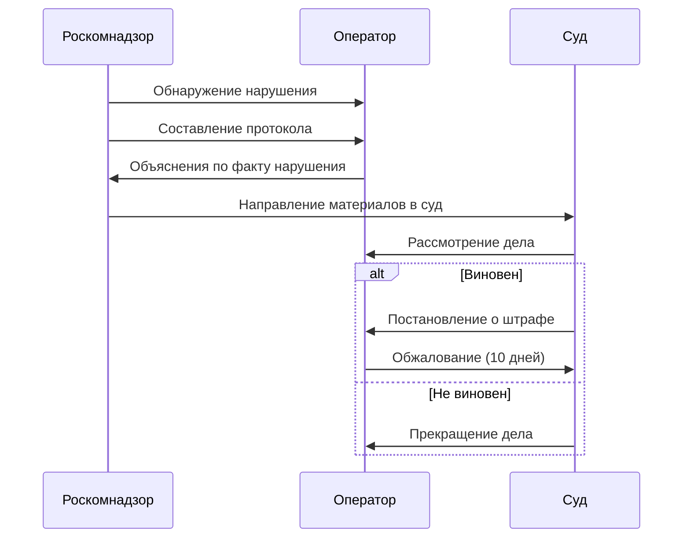

# **Контроль и надзор по персональным данным по ФЗ-152: Полное руководство**

## **🎯 Система контроля за обработкой ПДн**

### **1. Государственный надзор**

#### **Роскомнадзор - основной регулятор**
```yaml
Полномочия:
  - Проведение плановых и внеплановых проверок
  - Выдача предписаний об устранении нарушений
  - Составление протоколов об административных правонарушениях
  - Ведение реестра операторов ПДн
  - Обработка обращений субъектов ПДн
```

**Виды проверок:**
- **Плановые** - 1 раз в 3 года, по графику
- **Внеплановые** - по жалобам, при утечках, по требованию прокуратуры

**Процесс проверки:**


### **2. Внутренний контроль**

#### **Обязательные элементы системы внутреннего контроля:**

```yaml
Документация:
  - Политика обработки ПДн
  - Приказ о назначении ответственного
  - Реестр процессов обработки ПДн
  - Инструкции для сотрудников
  - Журналы учета обращений

Организационные меры:
  - Назначение ответственных лиц
  - Обучение сотрудников
  - Разграничение прав доступа
  - Учет носителей ПДн
  - Регулярные внутренние проверки

Технические меры:
  - Средства защиты информации
  - Резервное копирование
  - Антивирусная защита
  - Шифрование данных
  - Мониторинг инцидентов
```

#### **Чек-лист внутреннего контроля:**
```bash
✅ Разработана и опубликована Политика обработки ПДн
✅ Назначен ответственный за обработку ПДн
✅ Ведутся журналы обращений субъектов ПДн
✅ Сотрудники обучены и подписали обязательства о неразглашении
✅ Реализованы технические меры защиты
✅ Проводятся регулярные внутренние аудиты
```

### **3. Аудит безопасности ПДн**

#### **Виды аудита:**
- **Комплаенс-аудит** - соответствие требованиям 152-ФЗ
- **Технический аудит** - проверка систем защиты
- **Процессный аудит** - оценка процедур обработки

#### **Методика проведения аудита:**
```python
def conduct_pd_audit():
    # 1. Подготовительный этап
    Сбор_документации()
    Формирование_программы_аудита()
    
    # 2. Проверочный этап  
    Проверка_организационных_мер()
    Проверка_технических_мер()
    Тестирование_процедур()
    
    # 3. Отчетный этап
    Формирование_отчета()
    Разработка_рекомендаций()
    Контроль_исполнения()
```

#### **Типичные находки аудита:**
```yaml
Частые нарушения:
  - Отсутствие Политики обработки ПДн
  - Неполучение согласий на обработку
  - Неограниченный доступ сотрудников к ПДн
  - Отсутствие журналов учета
  - Невыполнение требований по защите
```

---

## **⚖️ Ответственность за нарушения**

### **1. Административная ответственность (КоАП РФ Статья 13.11)**

#### **Составы правонарушений:**

```yaml
Часть 1:
  Нарушение: Обработка ПДн в случаях, не предусмотренных законом
  Штраф: 
    - Граждане: 1-3 тыс. руб.
    - Должностные лица: 5-10 тыс. руб.
    - Юридические лица: 30-50 тыс. руб.

Часть 2:
  Нарушение: Обработка ПДн без согласия в письменной форме
  Штраф:
    - Граждане: 3-5 тыс. руб.
    - Должностные лица: 10-20 тыс. руб.
    - Юридические лица: 15-75 тыс. руб.

Часть 3:
  Нарушение: Невыполнение обязанностей по опубликованию Политики
  Штраф:
    - Должностные лица: 3-6 тыс. руб.
    - Юридические лица: 15-30 тыс. руб.

Часть 6:
  Нарушение: Невыполнение требований по защите ПДн
  Штраф:
    - Должностные лица: 10-20 тыс. руб.
    - Юридические лица: 25-100 тыс. руб.

Часть 7:
  Нарушение: Невыполнение предписания Роскомнадзора
  Штраф:
    - Должностные лица: 10-20 тыс. руб. или дисквалификация
    - Юридические лица: 50-100 тыс. руб.
```

#### **Процесс привлечения к административной ответственности:**


### **2. Уголовная ответственность (УК РФ)**

#### **Статья 137. Нарушение неприкосновенности частной жизни**

```yaml
Часть 1:
  Деяние: Незаконное собирание или распространение сведений о частной жизни
  Наказание:
    - Штраф до 200 тыс. руб. или зарплата за 18 месяцев
    - Обязательные работы до 360 часов
    - Исправительные работы до 1 года
    - Принудительные работы до 2 лет
    - Арест до 4 месяцев
    - Лишение свободы до 2 лет

Часть 2:
  Квалифицирующие признаки: Использование служебного положения
  Наказание:
    - Штраф 100-300 тыс. руб. или зарплата за 1-2 года
    - Лишение права занимать должности до 5 лет
    - Принудительные работы до 4 лет
    - Арест до 6 месяцев
    - Лишение свободы до 4 лет

Часть 3:
  Особо квалифицирующие признаки: Распространение в СМИ или интернете
  Наказание:
    - Штраф 150-350 тыс. руб. или зарплата за 1,5-3 года
    - Принудительные работы до 5 лет
    - Лишение свободы до 5 лет
```

#### **Статья 272. Неправомерный доступ к компьютерной информации**

```yaml
Условия применения:
  - Доступ к охраняемой законом информации
  - Совершен без права доступа
  - Повлек уничтожение, блокирование, модификацию, копирование

Наказание:
  - Штраф до 500 тыс. руб.
  - Исправительные работы до 1 года
  - Ограничение свободы до 2 лет
  - Принудительные работы до 5 лет
  - Лишение свободы до 5 лет
```

### **3. Практика правоприменения**

#### **Статистика Роскомнадзора за 2023 год:**
```yaml
Проведено проверок: 1,856
Выдано предписаний: 892
Составлено протоколов: 1,234
Наложено штрафов: 987
Общая сумма штрафов: ~85 млн. руб.
```

#### **Типичные кейсы из судебной практики:**

**Кейс 1: Интернет-магазин без согласия**
```bash
Ситуация: Сбор данных клиентов без оформления согласия
Нарушение: Ч. 2 ст. 13.11 КоАП РФ
Результат: Штраф 50,000 руб. + предписание
```

**Кейс 2: Утечка данных сотрудников**
```bash
Ситуация: База данных сотрудников в открытом доступе
Нарушение: Ч. 6 ст. 13.11 КоАП РФ + ст. 137 УК РФ
Результат: Штраф 100,000 руб. + уголовное дело
```

**Кейс 3: Невыполнение предписания**
```bash
Ситуация: Игнорирование предписания Роскомнадзора
Нарушение: Ч. 7 ст. 13.11 КоАП РФ
Результат: Штраф 70,000 руб. + приостановка деятельности
```

#### **Тенденции правоприменения:**
```yaml
Ужесточение контроля:
  - Увеличение количества внеплановых проверок
  - Рост сумм административных штрафов
  - Активная работа по жалобам граждан
  - Фокус на интернет-сервисы и соцсети

Приоритетные направления:
  - Сайты и онлайн-сервисы
  - HR-процессы компаний
  - Финансовый сектор
  - Здравоохранение и образование
```

---

## **🛡️ Меры по минимизации рисков**

### **Проактивная защита:**
```bash
✅ Регулярный комплаенс-аудит
✅ Обучение сотрудников
✅ Автоматизация процессов обработки ПДн
✅ Страхование киберрисков
✅ Юридическое сопровождение
```

### **План действий при проверке:**
```yaml
До проверки:
  - Ведение полного пакета документов
  - Регулярные внутренние аудиты
  - Готовность к внеплановой проверке

Во время проверки:
  - Фиксация всех действий проверяющих
  - Предоставление только запрошенных документов
  - Юридическое сопровождение

После проверки:
  - Анализ предписания
  - Разработка плана исправления
  - Обжалование при необходимости
```

### **Чек-лист соответствия:**
```python
def compliance_checklist():
    return [
        "Политика обработки ПДн разработана и опубликована",
        "Назначен ответственный за обработку ПДн", 
        "Получены все необходимые согласия",
        "Ведется реестр процессов обработки ПДн",
        "Реализованы меры защиты ПДн",
        "Сотрудники обучены",
        "Действует процедура работы с обращениями субъектов",
        "Ведется учет носителей ПДн"
    ]
```

**Важно:** Ответственность за нарушения несет не только организация, но и должностные лица - директор, ответственный за обработку ПДн, IT-специалисты. Регулярный контроль и аудит помогают избежать серьезных последствий! 🔒